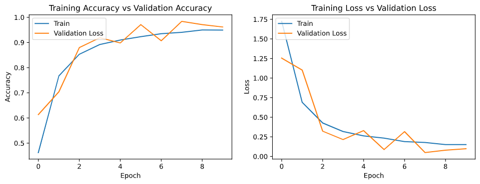

# CNN Sign Language 

- Used Keras to create a Convolutional Neural Network to train to recognize sign languages (American Standard)
- Explore the usage of Convolutional Neural Network and Applications with Keras
- Based on this challenge from Kaggle [click here to check it out](https://www.kaggle.com/datamunge/sign-language-mnist?select=sign_mnist_test)

# Here's the data on Training's Accuracy

